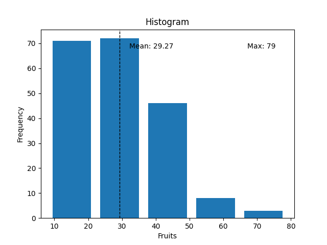

# SnakeAI
This repository contains the files and the code for my WnCC Summer of Code - 2021 Project (Snake AI)

In this project, I built the very popular Nokia Snake Game from scratch and then implemented basic Reinforcement Learning (RL) techniques to help the snake master the game and get really high scores. The RL agent is capable of learning on its own by exploring its environment to determine the best action to take in a certain situation.

___
## GIFs

___
## Game Demo
This is a keyboard controlled version of the game.
You can find the basic game demo
[here](https://drive.google.com/file/d/1CNqgc_5zQGanXpYcHHVvlu6Re66HdskK/view?usp=drivesdk)
___

## Assignment 1 - Maze Assignment
Worked on this assignment during the first week of May '21.

In this assignment, I had to implement a maze solver using Value Iteration. The program doesn't use memory efficient methods and is computationally heavy. The last 10x10 grid took >30 min to run. The objective of the assignment was to check the understanding that I developed with the help of David Silver's RL lectures of Sutton and Barto's book (in resources at the end) and to also get some hands on coding practice.

The assignment has two parts, in the first part we use the value iteration algorithm on an MDP. And in the second part we model our maze as an MDP and then attempt to solve it. In the data folder, you'll find the data for the maze as well as the mdp. You'll find more details in the assignment link. Ignore the linear programming and howard policy iteration part.
 
[Link to Assignment 1](https://www.cse.iitb.ac.in/~shivaram/teaching/old/cs747-a2020/pa-2/programming-assignment-2.html)

The generateMDP.py file generates a random MDP of the prescribed format.

The planner.py file runs the Value Iteration algorithm and assigns a value to each element which can then be used for further analysis.

The encoder.py file encodes the maze which is represented using the numbers- 0,1,2,3 as an MDP.

The decoder.py file then understands the output of the planner file and decides the shortest path between given points of a given maze.

The value_and_policy_file.txt and variables_needed.txt files are needed during the execution of the code.

The MazeVerifyOutput.py and PlannerVerifyOutput.py files check the output of the encoder and the planner files for the given data at once.

Visualize.py generates an image of the maze - with or without the shortest path

Solution.txt contains the solution for the shortest path in case of the given maze files

You can view the image of the solution in case of the 10x10 maze using gridFile.png
___
## Assignment 2 -  Windy Gridworld 
Worked on this assignment during the last week of May '21

In this assignment, we solve the Windy Gridworld problem of Barton and Sutto's book using different Model-free approaches - SARSA(0), Q-Learning, Expected-SARSA.

This is similar to a random walk experiment.
Q learning proves to be the best, outperforming all the other algorithms while Sarsa and Expected Sarsa have similar performances.  

[Sutton & Barto](https://www.andrew.cmu.edu/course/10-703/textbook/BartoSutton.pdf)  
[Link to the Assignment 2](https://www.cse.iitb.ac.in/~shivaram/teaching/old/cs747-a2020/pa-2/programming-assignment-3.html)

basic_moves.py only has the Sarsa implementation

diff_methods.py implements all 3 methods

kings_moves.py is the version in which moving diagonally is allowed

You can find the 3 plots in the folder too
___

## Simple RL Agent
Worked on this during the last week on June and first week of July '21

I have added a simple RL agent that uses Q learning to play the Snake Game. 
The game has an extremely large state space representation and we must use a reduced representation to make the task feasible.

### State Space
My representation uses 12 bits of information to describe the current state of the snake:
* 4 bits of information to define the relative position of the fruit with respect to the head of the snake.
* 8 bits of information for obstacles in up, down, left, right and the diagonal directions.

### Action Space
The snake has 4 possible actions:
* Go Up
* Go Left
* Go Down
* Go Right

Hence our Q matrix has dimensions **8x255x4**.

**8** comes from the relative position of the fruit with respect to the head of the snake.
**255** comes from the 8 bit obstacle space.
**4** comes from the 4 actions.

### Reward Scheme
I have used a fairly simple reward scheme that can be optimized to improve the performance of the agent:
* Reward of +1 if the snake moves closer to the fruit
* Reward of -2 if the snake moves away from the fruit
* Reward of +30 for eating the fruit
* Reward of -300 for crashing into the wall or itself

### Hyperparameters
The discount factor and &epsilon; parameter for an &epsilon;-greedy policy are 0.5 and 0.1. 
Without decaying these hyperparameters, the training behaviour of the agent is extremely erratic. With annealing, the performance is more consistent. 
The agent has achieved a maximum score of 79. 

The training time increases exponentially if we increase the state space (improve its vision).
___

### Training
We can get an idea about the training of our model by plotting the average number of fruits eaten by our snake in every 10 episodes as it trains.

For the smaller obstacle state, the training graph is as follows:

For the expanded obstacle state;

___

### Trained agent

We can plot a histogram of the number of fruits our agent consumes over a span of 300 episodes.
This gives us an estimate of our performance. I've also added mean and max data outputs on the histogram itself.

___

The font, graphics and sound folder contain the files required for developing the PyGame based basic game.

Environment.py has the information about the environment i.e. the fruit, walls, snake body etc. that is fed to the algorithm.

**Run Untrained_agent.py to see it training** at a sped up rate.

Warning: It takes a lot of time to reach convergence so feel free to quit the game after a while even if it crashes.

**Run Agent.py to see the trained agent play** at a normal rate.

You can ignore the various .npy files. They are used to feed the final trained data to Agent.py.

**fruits_episodes.png** shows the training graph of the expanded obstacle space.

**fruits_episodes_1.pg** shows the training graph of the limited obstacle space i.e. no diagonal elements.

You can see that training the expanded obstacle space is much slower.

**fruits_episodes_hist.png** shows the histogram data of the number of fruits the *trained snake* eats across 100 episodes.

___
## Future Prospects

I plan on using the Deep Learning approach and using CNNs for better performance using an expanded state space.

___ 

## Resources
[Learning Resources](https://www.notion.so/SOC-Snake-AI-Project-471ff57983a24f749ca0ec08df8c9472 "Learning Resources")

____
